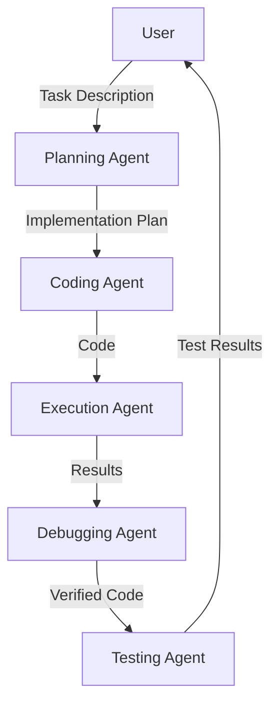

# AutoGen Development Framework

A sophisticated multi-agent development framework built on AutoGen that automates the software development lifecycle using specialized AI agents. The framework orchestrates collaboration between planning, coding, execution, debugging, and testing agents to deliver robust software solutions.


## 🌟 Features

- **Automated Development Pipeline**: End-to-end software development automation
- **Specialized AI Agents**: Purpose-built agents for each development phase
- **Robust Error Handling**: Comprehensive debugging and error recovery
- **Extensive Testing**: Automated test generation and execution
- **Clear Documentation**: Auto-generated documentation and code comments

## 🤖 Agent Roles

- **Planning Agent**: Task analysis and implementation planning
- **Coding Agent**: Code implementation and documentation
- **Execution Agent**: Safe code execution and output capture
- **Debugging Agent**: Error analysis and bug fixing
- **Testing Agent**: Test creation and validation

## 🚀 Quick Start

### Prerequisites

- Python 3.9 or higher
- OpenAI API key
- Git

### Installation

1. Clone the repository:
```bash
git clone https://github.com/yourusername/autogen-dev-framework.git
cd autogen-dev-framework
```

2. Create and activate virtual environment:
```bash
python -m venv venv
source venv/bin/activate  # On Windows: .\venv\Scripts\activate
```

3. Install dependencies:
```bash
pip install -r requirements.txt
```

4. Configure your environment:
```bash
cp .env.example .env
# Edit .env with your OpenAI API key
```

### Basic Usage

```python
import asyncio
from src.agents.team import DevelopmentTeam

async def main():
    # Initialize the development team
    team = DevelopmentTeam()
    
    # Define your coding task
    task = """
    Create a function that:
    1. Takes a list of numbers as input
    2. Returns the sum of all even numbers
    """
    
    # Let the team solve the task
    await team.solve_task(task)

if __name__ == "__main__":
    asyncio.run(main())
```

## 📖 Example Workflows

### 1. Basic Function Implementation
```python
task = "Implement a function to calculate the factorial of a number"
await team.solve_task(task)
```

### 2. Data Structure Implementation
```python
task = """
Create a binary search tree implementation with the following methods:
- insert
- search
- delete
Include proper error handling and documentation.
"""
await team.solve_task(task)
```

### 3. Algorithm Development
```python
task = """
Implement a sorting algorithm that:
1. Takes advantage of partially sorted input
2. Has O(n log n) worst-case complexity
3. Uses minimal extra space
"""
await team.solve_task(task)
```

## 🔧 Configuration

### Custom Model Configuration
```python
from src.agents.team import DevelopmentTeam
from config import CustomModelConfig

team = DevelopmentTeam(
    model_config=CustomModelConfig(
        model="gpt-4-0125-preview",
        temperature=0.7,
        max_tokens=2000
    )
)
```

### Custom Tools Integration
```python
from src.tools import CustomCodeExecutor

team = DevelopmentTeam(
    tools=[CustomCodeExecutor()]
)
```

## 📊 System Architecture



## 🔍 Advanced Features

### Code Analysis
```python
# Get detailed code analysis
analysis = await team.analyze_code(code_snippet)
```

### Test Generation
```python
# Generate comprehensive test suite
tests = await team.generate_tests(implementation)
```

### Performance Optimization
```python
# Optimize existing implementation
optimized_code = await team.optimize_code(
    code=implementation,
    optimization_target="speed"
)
```

## 🛠️ Development

### Running Tests
```bash
pytest src/tests/
```

### Code Style
```bash
# Format code
black src/

# Check types
mypy src/
```

## 📚 Documentation

For detailed documentation, see:
- [Technical Architecture](docs/architecture.md)
- [API Reference](docs/api.md)
- [Configuration Guide](docs/configuration.md)
- [Contributing Guide](CONTRIBUTING.md)

## 🤝 Contributing

Contributions are welcome! Please read our [Contributing Guide](CONTRIBUTING.md) for details on our code of conduct and the process for submitting pull requests.

1. Fork the repository
2. Create your feature branch: `git checkout -b feature/amazing-feature`
3. Commit your changes: `git commit -m 'Add amazing feature'`
4. Push to the branch: `git push origin feature/amazing-feature`
5. Open a Pull Request

## 📝 License

This project is licensed under the MIT License - see the [LICENSE](LICENSE) file for details.

## 🙏 Acknowledgments

- Built with [AutoGen](https://github.com/microsoft/autogen)
- Inspired by modern software development practices
- Thanks to all contributors and the open source community

## 📧 Contact

- Project Link: [https://github.com/yourusername/autogen-dev-framework](https://github.com/yourusername/autogen-dev-framework)
- Report Issues: [Issue Tracker](https://github.com/yourusername/autogen-dev-framework/issues)

---
⭐ Star us on GitHub — it motivates us to make the framework even better!